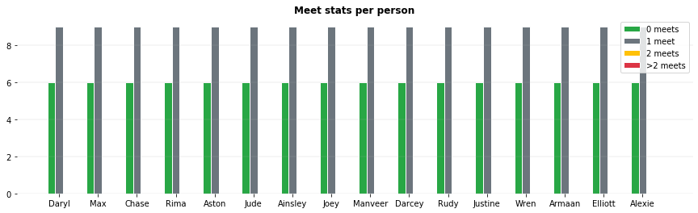

# roster-maker

<div style = "background-color:#007bff">Test if inline style does work</div>

<div id='badges'>
    <div style="overflow:auto">
        <div class="tech">python</div>
        <div class="dependencies_header">Dependencies:</div>
        <div class="dependencies">Matplotlib</div> 
        <div class="dependencies_header">Optional:</div>
        <div class="dependencies">Jupyter notebook</div> 
        <div class="dependencies">IPython</div> 
    </div>
</div>


Make a schedule where people are assigned to rooms and optimize the number of individuals everyone sees. Can also be used as tournament scheduler, where teams have to meet all other rounds in different rounds.

I do not know the exact name of the underlying math problem. Instead of first researching the problem, I tried to come up with a working solution on my own in one day as an excercise in object oriented programming and algorithm design. 

## Problem description
For work we are organizing a workshop. Because of the whole working remotely situation we had to make the workshop suitable as a video meeting. In my experience, having a video meeting with a lot of people (in this case 17) reduces the engagement of most people and thus the overall interactivity. A problem we would not have in a workshop at site. 

We came up with the solution to divide the workshop in rounds. Each round has smaller videomeetings and between the rounds the participants have to change between the videomeetings. This way we keep the video meetings in smaller groups and thus hope to increase the engagement.

Moreover, the goal of the workshop was to get back together after 6 months and pitch what we had done. Thus it is important that everyone meets everyone else at least once during a round (or for efficiency just once).

## Solution
The outcome is an unoptimized, brute force, greedy algorithm implemented in python. The algorithm just wants to loop over all solutions (however not implemented yet) and starts by just pushing people into a room (web meeting) if possible without looking ahead. But I think the general framework is a good starting point for testing/implementing other algorithms.

## Example usage
The script can be used by making a *Schedule* instance and passing it..
 * ..the name of the people (or teams if you are making a tournament schedule) as a list, 
 * ..the number of rounds, 
 * ..the number of rooms, 
 * ..the room size per room (nr_persons_per_room, as a list),
 * ..the name of the rooms (or the links to the video meetings for that matter) as a list, optional, 
 * ..and the number of max allowed meets (initializing with higher than 1 gives up to. now unwanted results due to greedy approach).

After the initialization you can make a schedule with the algorithm by calling *make_schedule* on the instance. The results can be inspected by the functions *print_schedule_stats*, *print_schedules_in_jupyter_notebook* (if you are running it in a jupyter notebook) and *print_schedules*.

### Example code
For instance, making a schedule for 16 people with 4 people per room:

```python
# Example usage
names = ['Daryl','Max', 'Chase', 'Rima', 'Aston', 'Jude', 'Ainsley', 'Joey', 'Manveer', 'Darcey', 'Rudy', 'Justine', 'Wren', 'Armaan', 'Elliott', 'Alexie']

# Initialize the schedule object, set the configurations
new_schedule = Schedule(
    max_meets_allowed = 1, 
    nr_rounds = 3, 
    nr_rooms = 4, 
    nr_persons_per_room = [4 for i in range(4)], 
    person_names = names,
    room_names = None
)

# Make the schedule
new_schedule.make_schedule()

#print stats
new_schedule.print_schedule_stats()

# Print the schedule
try:
    new_schedule.print_schedules_in_jupyter_notebook()
except:
    print('It was not possible to print the schedules neatly, this means that..\n\n  ..or you are not running in jupiter notebook\n  ..or you do not have IPython pip installed\n\n')
    
new_schedule.print_schedules()
```

### Example otucome
The outcome of the above example split by function:

#### print_schedule_stats

Grouped bar chart with the meeting stats per person:



|Matching stats||
|:--|:---|
|Number of people that dont meet :                 | 16|
|Average number of persons that succesfully meet : | 15.0|
|                                                  |  |
|Person with the most doubles :                    | Daryl, Max, Chase, Rima, Aston, Jude, Ainsley, Joey, Manveer, Darcey, Rudy, Justine, Wren, Armaan, Elliott, Alexie [0]|
|Person with the fewest doubles :                  | Daryl, Max, Chase, Rima, Aston, Jude, Ainsley, Joey, Manveer, Darcey, Rudy, Justine, Wren, Armaan, Elliott, Alexie [0]|
|                                                  |  |
|Person with the most 0 meets :                    | Daryl, Max, Chase, Rima, Aston, Jude, Ainsley, Joey, Manveer, Darcey, Rudy, Justine, Wren, Armaan, Elliott, Alexie [6]|
|Person with the fewest 0 meets :                  | Daryl, Max, Chase, Rima, Aston, Jude, Ainsley, Joey, Manveer, Darcey, Rudy, Justine, Wren, Armaan, Elliott, Alexie [6]|

<br>

#### print_schedules_in_jupyter_notebook

The overall schedule

|               |                              round 1|                              round 2|                              round 3|
|:-------------:|:-----------------------------------:|:-----------------------------------:|:-----------------------------------:| 
| **room<br>A** |        Daryl<br>Max<br>Chase<br>Rima|    Daryl<br>Aston<br>Manveer<br>Wren|      Daryl<br>Jude<br>Rudy<br>Alexie|
| **room<br>B** |     Aston<br>Jude<br>Ainsley<br>Joey|      Max<br>Jude<br>Darcey<br>Armaan|   Max<br>Aston<br>Justine<br>Elliott|
| **room<br>C** | Manveer<br>Darcey<br>Rudy<br>Justine|  Chase<br>Ainsley<br>Rudy<br>Elliott|   Chase<br>Joey<br>Manveer<br>Armaan|
| **room<br>D** |  Wren<br>Armaan<br>Elliott<br>Alexie|    Rima<br>Joey<br>Justine<br>Alexie|    Rima<br>Ainsley<br>Darcey<br>Wren|

<br>
The roadmap per person

|             | round 1| round 2| round 3|
|:-----------:|:------:|:------:|:------:| 
|   **Daryl** |       A|       A|       A|
|     **Max** |       A|       B|       B|
|   **Chase** |       A|       C|       C|
|    **Rima** |       A|       D|       D|
|   **Aston** |       B|       A|       B|
|    **Jude** |       B|       B|       A|
| **Ainsley** |       B|       C|       D|
|    **Joey** |       B|       D|       C|
| **Manveer** |       C|       A|       C|
|  **Darcey** |       C|       B|       D|
|    **Rudy** |       C|       C|       A|
| **Justine** |       C|       D|       B|
|    **Wren** |       D|       A|       D|
|  **Armaan** |       D|       B|       C|
| **Elliott** |       D|       C|       B|
|  **Alexie** |       D|       D|       A|

<br>
The matrix where each person meets each other in round number - room

|             |   Daryl|     Max|   Chase|    Rima|   Aston|    Jude| Ainsley|    Joey| Manveer|  Darcey|    Rudy| Justine|    Wren|  Armaan| Elliott|  Alexie|
|:-----------:|:------:|:------:|:------:|:------:|:------:|:------:|:------:|:------:|:------:|:------:|:------:|:------:|:------:|:------:|:------:|:------:| 
|   **Daryl** |        |   1 - A|   1 - A|   1 - A|   2 - A|   3 - A|        |        |   2 - A|        |   3 - A|        |   2 - A|        |        |   3 - A|
|     **Max** |   1 - A|        |   1 - A|   1 - A|   3 - B|   2 - B|        |        |        |   2 - B|        |   3 - B|        |   2 - B|   3 - B|        |
|   **Chase** |   1 - A|   1 - A|        |   1 - A|        |        |   2 - C|   3 - C|   3 - C|        |   2 - C|        |        |   3 - C|   2 - C|        |
|    **Rima** |   1 - A|   1 - A|   1 - A|        |        |        |   3 - D|   2 - D|        |   3 - D|        |   2 - D|   3 - D|        |        |   2 - D|
|   **Aston** |   2 - A|   3 - B|        |        |        |   1 - B|   1 - B|   1 - B|   2 - A|        |        |   3 - B|   2 - A|        |   3 - B|        |
|    **Jude** |   3 - A|   2 - B|        |        |   1 - B|        |   1 - B|   1 - B|        |   2 - B|   3 - A|        |        |   2 - B|        |   3 - A|
| **Ainsley** |        |        |   2 - C|   3 - D|   1 - B|   1 - B|        |   1 - B|        |   3 - D|   2 - C|        |   3 - D|        |   2 - C|        |
|    **Joey** |        |        |   3 - C|   2 - D|   1 - B|   1 - B|   1 - B|        |   3 - C|        |        |   2 - D|        |   3 - C|        |   2 - D|
| **Manveer** |   2 - A|        |   3 - C|        |   2 - A|        |        |   3 - C|        |   1 - C|   1 - C|   1 - C|   2 - A|   3 - C|        |        |
|  **Darcey** |        |   2 - B|        |   3 - D|        |   2 - B|   3 - D|        |   1 - C|        |   1 - C|   1 - C|   3 - D|   2 - B|        |        |
|    **Rudy** |   3 - A|        |   2 - C|        |        |   3 - A|   2 - C|        |   1 - C|   1 - C|        |   1 - C|        |        |   2 - C|   3 - A|
| **Justine** |        |   3 - B|        |   2 - D|   3 - B|        |        |   2 - D|   1 - C|   1 - C|   1 - C|        |        |        |   3 - B|   2 - D|
|    **Wren** |   2 - A|        |        |   3 - D|   2 - A|        |   3 - D|        |   2 - A|   3 - D|        |        |        |   1 - D|   1 - D|   1 - D|
|  **Armaan** |        |   2 - B|   3 - C|        |        |   2 - B|        |   3 - C|   3 - C|   2 - B|        |        |   1 - D|        |   1 - D|   1 - D|
| **Elliott** |        |   3 - B|   2 - C|        |   3 - B|        |   2 - C|        |        |        |   2 - C|   3 - B|   1 - D|   1 - D|        |   1 - D|
|  **Alexie** |   3 - A|        |        |   2 - D|        |   3 - A|        |   2 - D|        |        |   3 - A|   2 - D|   1 - D|   1 - D|   1 - D|        |

<br>

#### print_schedules

The output in markdown.

```markdown
The overall schedule

|               |                              round 1|                              round 2|                              round 3|
|:-------------:|:-----------------------------------:|:-----------------------------------:|:-----------------------------------:| 
| **room<br>A** |        Daryl<br>Max<br>Chase<br>Rima|    Daryl<br>Aston<br>Manveer<br>Wren|      Daryl<br>Jude<br>Rudy<br>Alexie|
| **room<br>B** |     Aston<br>Jude<br>Ainsley<br>Joey|      Max<br>Jude<br>Darcey<br>Armaan|   Max<br>Aston<br>Justine<br>Elliott|
| **room<br>C** | Manveer<br>Darcey<br>Rudy<br>Justine|  Chase<br>Ainsley<br>Rudy<br>Elliott|   Chase<br>Joey<br>Manveer<br>Armaan|
| **room<br>D** |  Wren<br>Armaan<br>Elliott<br>Alexie|    Rima<br>Joey<br>Justine<br>Alexie|    Rima<br>Ainsley<br>Darcey<br>Wren|

<br>
The roadmap per person

|             | round 1| round 2| round 3|
|:-----------:|:------:|:------:|:------:| 
|   **Daryl** |       A|       A|       A|
|     **Max** |       A|       B|       B|
|   **Chase** |       A|       C|       C|
|    **Rima** |       A|       D|       D|
|   **Aston** |       B|       A|       B|
|    **Jude** |       B|       B|       A|
| **Ainsley** |       B|       C|       D|
|    **Joey** |       B|       D|       C|
| **Manveer** |       C|       A|       C|
|  **Darcey** |       C|       B|       D|
|    **Rudy** |       C|       C|       A|
| **Justine** |       C|       D|       B|
|    **Wren** |       D|       A|       D|
|  **Armaan** |       D|       B|       C|
| **Elliott** |       D|       C|       B|
|  **Alexie** |       D|       D|       A|

<br>
The matrix where each person meets each other in round number - room

|             |   Daryl|     Max|   Chase|    Rima|   Aston|    Jude| Ainsley|    Joey| Manveer|  Darcey|    Rudy| Justine|    Wren|  Armaan| Elliott|  Alexie|
|:-----------:|:------:|:------:|:------:|:------:|:------:|:------:|:------:|:------:|:------:|:------:|:------:|:------:|:------:|:------:|:------:|:------:| 
|   **Daryl** |        |   1 - A|   1 - A|   1 - A|   2 - A|   3 - A|        |        |   2 - A|        |   3 - A|        |   2 - A|        |        |   3 - A|
|     **Max** |   1 - A|        |   1 - A|   1 - A|   3 - B|   2 - B|        |        |        |   2 - B|        |   3 - B|        |   2 - B|   3 - B|        |
|   **Chase** |   1 - A|   1 - A|        |   1 - A|        |        |   2 - C|   3 - C|   3 - C|        |   2 - C|        |        |   3 - C|   2 - C|        |
|    **Rima** |   1 - A|   1 - A|   1 - A|        |        |        |   3 - D|   2 - D|        |   3 - D|        |   2 - D|   3 - D|        |        |   2 - D|
|   **Aston** |   2 - A|   3 - B|        |        |        |   1 - B|   1 - B|   1 - B|   2 - A|        |        |   3 - B|   2 - A|        |   3 - B|        |
|    **Jude** |   3 - A|   2 - B|        |        |   1 - B|        |   1 - B|   1 - B|        |   2 - B|   3 - A|        |        |   2 - B|        |   3 - A|
| **Ainsley** |        |        |   2 - C|   3 - D|   1 - B|   1 - B|        |   1 - B|        |   3 - D|   2 - C|        |   3 - D|        |   2 - C|        |
|    **Joey** |        |        |   3 - C|   2 - D|   1 - B|   1 - B|   1 - B|        |   3 - C|        |        |   2 - D|        |   3 - C|        |   2 - D|
| **Manveer** |   2 - A|        |   3 - C|        |   2 - A|        |        |   3 - C|        |   1 - C|   1 - C|   1 - C|   2 - A|   3 - C|        |        |
|  **Darcey** |        |   2 - B|        |   3 - D|        |   2 - B|   3 - D|        |   1 - C|        |   1 - C|   1 - C|   3 - D|   2 - B|        |        |
|    **Rudy** |   3 - A|        |   2 - C|        |        |   3 - A|   2 - C|        |   1 - C|   1 - C|        |   1 - C|        |        |   2 - C|   3 - A|
| **Justine** |        |   3 - B|        |   2 - D|   3 - B|        |        |   2 - D|   1 - C|   1 - C|   1 - C|        |        |        |   3 - B|   2 - D|
|    **Wren** |   2 - A|        |        |   3 - D|   2 - A|        |   3 - D|        |   2 - A|   3 - D|        |        |        |   1 - D|   1 - D|   1 - D|
|  **Armaan** |        |   2 - B|   3 - C|        |        |   2 - B|        |   3 - C|   3 - C|   2 - B|        |        |   1 - D|        |   1 - D|   1 - D|
| **Elliott** |        |   3 - B|   2 - C|        |   3 - B|        |   2 - C|        |        |        |   2 - C|   3 - B|   1 - D|   1 - D|        |   1 - D|
|  **Alexie** |   3 - A|        |        |   2 - D|        |   3 - A|        |   2 - D|        |        |   3 - A|   2 - D|   1 - D|   1 - D|   1 - D|        |

```


<style>
    .dependencies, .tech, .dependencies_header {
        padding:3px 5px; 
        border-radius:4px; 
        float:left;
        margin: 5px 2px; 
        font-size:12px;
    }
    .tech{
        background-color:#28a745; 
        color:#fff;
        font-size:14px;
    }
    .dependencies {
        background-color:#007bff; 
        color:#fff;
    }
     .dependencies_header {
         margin-left:10px;
         margin-right:0px;
     }
</style>
